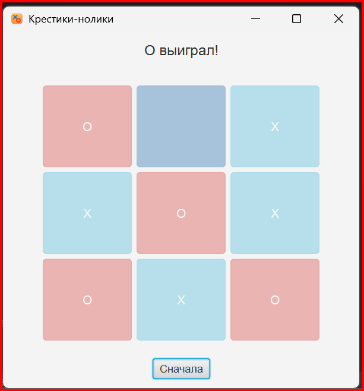

# TicTacToeJavaFX

## 🎮Простая игра "Крестики-нолики", созданная на JavaFX 17 с использованием Maven и стилизации через BootstrapFX.

---
### Скриншот

## 🔧 Технологии

- Java 23
- JavaFX 17 (controls, fxml)
- BootstrapFX (стилизация)
- ControlsFX (готово к расширению)
- Maven
- JDK 23 с поддержкой JavaFX

